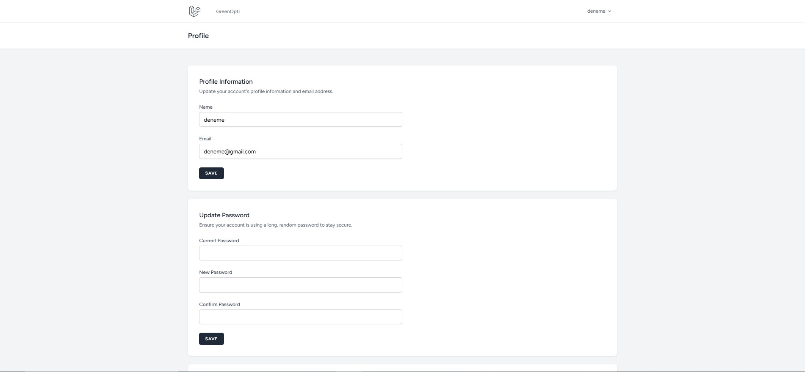

# GreenOpti - Akıllı Ulaşım Optimizasyonu

## Proje Hakkında
Bu proje, farklı ulaşım modları (kara, hava, deniz ve tren) arasında en optimum rotayı belirleyerek karbon emisyonunu azaltmayı, zaman ve maliyet optimizasyonunu sağlamayı amaçlayan bir web uygulamasıdır.

## 🚧 Geliştirme Aşaması
Proje şu anda aktif geliştirme aşamasındadır. Aşağıdaki özellikler yakında eklenecektir:

### Planlanan Özellikler
- [ ] Çoklu Ulaşım Modu Analizi
  - Kara yolu optimizasyonu
  - Hava yolu optimizasyonu
  - Deniz yolu optimizasyonu
  - Tren yolu optimizasyonu

- [ ] Optimizasyon Kriterleri
  - Karbon emisyonu hesaplama
  - Zaman optimizasyonu
  - Maliyet analizi
  - Kombine rota önerileri

- [ ] Raporlama Sistemi
  - Emisyon raporları
  - Maliyet karşılaştırma
  - Zaman analizi
  - Optimizasyon önerileri

### Yakında Eklenecek
- Gerçek zamanlı rota takibi
- Yapay zeka destekli rota optimizasyonu
- Detaylı karbon ayak izi analizi
- İnteraktif harita entegrasyonu

## Ekran Görüntüleri

<details>
<summary><b>Rota Hesaplama</b></summary>
<br>

</details>

<details>
<summary><b>Profil Sayfası</b></summary>
<br>

</details>

## Kurulum

### Gereksinimler
- PHP >= 8.1
- Composer
- Node.js & NPM
- MySQL veya PostgreSQL
- Git

### Adım Adım Kurulum

1. **Repository'yi klonlayın:**
```bash
git clone https://github.com/keremayyilmazz/GreenOpti.git
cd GreenOpti
```

2. **Composer bağımlılıklarını yükleyin:**
```bash
composer install
```

3. **NPM bağımlılıklarını yükleyin:**
```bash
npm install
```

4. **Ortam değişkenlerini ayarlayın:**
```bash
# .env.example dosyasını kopyalayın
cp .env.example .env

# Uygulama anahtarını oluşturun
php artisan key:generate
```

5. **Veritabanını ayarlayın:**
- MySQL'de yeni bir veritabanı oluşturun
- .env dosyasında veritabanı bilgilerinizi düzenleyin:
```bash
DB_CONNECTION=mysql
DB_HOST=127.0.0.1
DB_PORT=3306
DB_DATABASE=greenopti_db
DB_USERNAME=root
DB_PASSWORD=
```

6. **Veritabanı tablolarını oluşturun:**
```bash
# Tabloları oluşturun
php artisan migrate

# (Opsiyonel) Örnek verileri yükleyin
php artisan db:seed
```

7. **Uygulamayı çalıştırın:**
```bash
# Laravel sunucusunu başlatın
php artisan serve

# Yeni bir terminal açın ve asset'leri derleyin
npm run dev
```

8. **Tarayıcıda açın:**
- [http://localhost:8000](http://localhost:8000)

### Varsayılan Giriş Bilgileri
```
Admin Kullanıcısı:
Email: admin@example.com
Şifre: password
```

## Proje Yapısı

```
project/
├── app/
│   ├── Http/
│   │   └── Controllers/    # Controller sınıfları
│   └── Models/            # Veritabanı modelleri
├── config/               # Yapılandırma dosyaları
├── database/
│   ├── migrations/      # Veritabanı migration'ları
│   └── seeders/        # Veritabanı seed'leri
├── public/             # Genel erişime açık dosyalar
├── resources/
│   ├── css/           # Stil dosyaları
│   ├── js/           # JavaScript dosyaları
│   └── views/        # Blade template'leri
├── routes/           # Rota tanımlamaları
└── tests/           # Test dosyaları
```

## API Dokümantasyonu

### Kullanılabilir Endpoint'ler

#### Rota Optimizasyonu
```bash
# Rota Hesaplama
GET /api/routes/calculate          - Optimum rota hesaplama
POST /api/routes/compare          - Farklı rotaları karşılaştırma

# Emisyon Analizi
GET /api/emission/calculate       - Karbon emisyonu hesaplama
GET /api/emission/compare         - Farklı rotaların emisyon karşılaştırması
```

#### Ulaşım Modları
```bash
# Kara Yolu
GET /api/transport/road           - Kara yolu rotaları
GET /api/transport/road/{id}      - Spesifik kara yolu detayı

# Hava Yolu
GET /api/transport/air            - Hava yolu rotaları
GET /api/transport/air/{id}       - Spesifik hava yolu detayı

# Deniz Yolu
GET /api/transport/sea            - Deniz yolu rotaları
GET /api/transport/sea/{id}       - Spesifik deniz yolu detayı

# Tren Yolu
GET /api/transport/rail           - Tren rotaları
GET /api/transport/rail/{id}      - Spesifik tren yolu detayı
```

#### Optimizasyon Raporları
```bash
# Zaman Bazlı Raporlar
GET /api/reports/daily            - Günlük optimizasyon raporu
GET /api/reports/monthly          - Aylık optimizasyon raporu
GET /api/reports/yearly           - Yıllık optimizasyon raporu

# Analiz Raporları
GET /api/analysis/emission        - Emisyon analiz raporu
GET /api/analysis/cost            - Maliyet analiz raporu
GET /api/analysis/time            - Zaman optimizasyon raporu
```

### Not
API endpoint'leri geliştirme aşamasındadır ve değişiklik gösterebilir. Güncel dokümantasyon için lütfen düzenli olarak kontrol ediniz.

## 🛠️ Teknolojiler

-  Laravel 10
-  Vue.js 3
-  Tailwind CSS
-  Leaflet Maps


## 👥 Katkıda Bulunanlar

- [Kerem Ayyılmaz](https://github.com/keremayyilmazz) - Geliştirici
